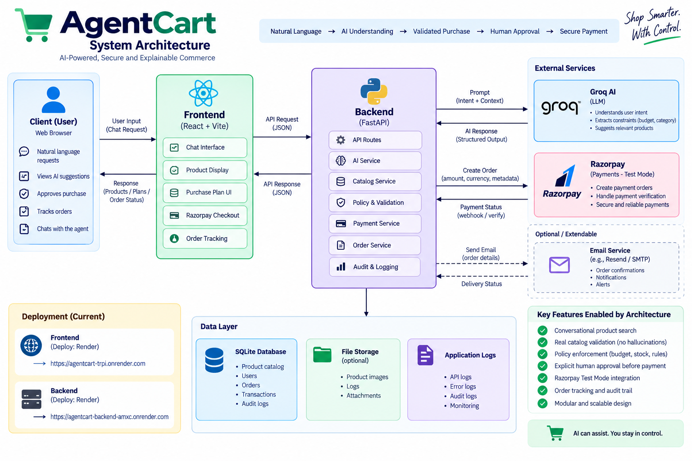

# 🛒 AgentCart

## Explainable AI-Powered Agentic Commerce

> **AgentCart turns a natural-language shopping request into a
> policy-checked, human-approved, auditable transaction.**

**Razorpay AI Builder Internship 2026 --- Buildathon**\
**Track 01 --- AI Growth & Agentic Commerce**

### 🌐 Live Project

-   **Live Frontend:** https://agentcart-trpi.onrender.com/
-   **Live Backend:** https://agentcart-backend-amxc.onrender.com/
-   **GitHub Repository:** https://github.com/Satyanarayana001/Agentcart

------------------------------------------------------------------------

## 1. What is AgentCart?

AgentCart is an AI-powered agentic commerce application that lets a
customer express a shopping goal in natural language instead of manually
navigating a traditional shopping flow.

For example:

``` text
Buy wireless ANC headphones under ₹5000
```

AgentCart interprets the request, checks it against the merchant's
actual catalog, validates the proposed purchase using deterministic
backend rules, explains the recommendation, creates a purchase plan, and
waits for explicit customer approval.

Only after approval can the payment stage begin.

The central idea is simple:

> **AI can assist with commerce without receiving unrestricted authority
> over money.**

------------------------------------------------------------------------

## 2. Buildathon Track Alignment

AgentCart is built for **Track 01: AI Growth & Agentic Commerce**.

The project demonstrates an AI buyer experience around:

-   Conversational commerce
-   Agent-readable catalog interaction
-   Product recommendation
-   Explainable decisions
-   Bounded purchase policies
-   Human approval before payment
-   Razorpay Test Mode payment
-   Backend payment verification
-   Auditability
-   Graceful failure handling

The implementation focuses on the Buildathon requirement that money
actions should be **explainable, bounded, and gated**.

------------------------------------------------------------------------

## 3. Core Flow

``` text
Customer Intent
      ↓
AI Interpretation
      ↓
Catalog Validation
      ↓
Policy Validation
      ↓
Purchase Plan
      ↓
Human Approval
      ↓
Razorpay Test Payment
      ↓
Backend Payment Verification
      ↓
Order + Audit
      ↓
Tracking + Notifications
```

### Intelligence vs Authority

``` text
AI
 ├─ Understand intent
 ├─ Recommend
 └─ Explain

Backend
 ├─ Validate catalog
 ├─ Enforce policy
 ├─ Validate state
 └─ Verify payment

Customer
 └─ Approve or reject

Payment
 └─ Happens only after the required controls
```

------------------------------------------------------------------------

## 4. Why This Problem Matters

Traditional e-commerce works well when customers already know what
product they want.

But a customer may instead have a goal:

``` text
I need wireless ANC headphones under ₹5000.
```

A conventional workflow may require search, filters, comparison, stock
checks, product selection, checkout, and payment.

Agentic commerce can reduce discovery friction by allowing the customer
to express the goal directly.

The challenge is trust.

An AI commerce agent should not:

-   Invent products that are not in the merchant catalog
-   Silently substitute an unavailable product
-   Increase the customer's budget without consent
-   Ignore stock or quantity constraints
-   Approve its own recommendation
-   Treat an unverified payment as successful

AgentCart is designed around these boundaries.

------------------------------------------------------------------------

## 5. Key Capabilities

### Conversational Product Discovery

Customers describe what they want using natural language.

### AI Product Recommendation

The AI interprets product category, features, quantity, and budget and
recommends a product from the controlled catalog.

### Explainability

A visible **Why this product?** explanation connects the recommendation
to the customer's request.

### Deterministic Policy Validation

The backend independently validates:

``` text
Product
  ↓
Quantity
  ↓
Stock
  ↓
Budget
  ↓
Purchase State
```

### Human Approval

The customer explicitly approves the purchase plan before the
payment-order stage.

### No Silent Substitution

If a requested category does not exist, AgentCart returns:

``` text
CATALOG_INQUIRY
```

No purchase plan or approval gate is created.

If a genuine product exists but is out of stock, available alternatives
can be shown and the customer explicitly chooses one.

### Budget Preservation

The customer's original budget remains authoritative.

``` text
Original budget: ₹5000
Alternative:     ₹5799
```

AgentCart does not silently change:

``` text
₹5000 → ₹5799
```

### Razorpay Test Mode

The payment flow is:

``` text
Approved Plan
      ↓
Razorpay Order
      ↓
Checkout
      ↓
Payment Response
      ↓
Backend Verification
      ↓
Purchase Completed
```

### Orders, Tracking, Notifications, and Audit

Important transaction state is persisted so that the application can
show order history, controlled fulfillment tracking, in-app
notifications, and an inspectable audit timeline.

------------------------------------------------------------------------

## 6. Visual Architecture

### System Architecture



### Agentic Commerce Flow


### Money & Safety Boundary


### Failure Handling / Catalog Inquiry


> These diagrams are documentation visuals and are not screenshots of
> the deployed application.

------------------------------------------------------------------------

## 7. System Architecture

``` text
                    CUSTOMER
                       │
                       ▼
              ┌─────────────────┐
              │ React Frontend  │
              │     + Vite      │
              └────────┬────────┘
                       │ HTTP
                       ▼
              ┌─────────────────┐
              │ FastAPI Backend │
              └────────┬────────┘
                       │
          ┌────────────┼────────────┐
          ▼            ▼            ▼
       SQLite         Groq       Razorpay
      Database         AI        Test Mode
```

The frontend handles the customer experience.

The FastAPI backend owns business rules and transaction state.

Groq provides the AI interpretation layer.

Razorpay Test Mode provides the payment demonstration.

SQLite provides persistence for the current Buildathon implementation.

See [`docs/architecture.md`](docs/architecture.md) for the detailed
architecture.

------------------------------------------------------------------------

## 8. Failure Handling

A particularly important scenario is:

``` text
Is there any TV?
```

The current controlled catalog does not contain TV products.

AgentCart therefore returns:

``` text
CATALOG_INQUIRY
```

and does **not**:

-   Invent a TV
-   Select an unrelated product
-   Create a purchase plan
-   Show an approval gate
-   Initiate payment

The customer remains in control and can choose an actual catalog
product.

This demonstrates graceful failure rather than forcing the AI to produce
a purchase.

See [`docs/failure-handling.md`](docs/failure-handling.md).

------------------------------------------------------------------------

## 9. Safety Model

``` text
AI Recommendation
        ↓
Backend Policy Validation
        ↓
Human Approval
        ↓
Razorpay Test Payment
        ↓
Backend Payment Verification
        ↓
Order + Audit
```

Core invariants:

``` text
AI recommendation ≠ authorization
AI output ≠ business-rule validation
Missing category ≠ invented product
Out-of-stock ≠ silent substitution
Alternative price ≠ automatic budget increase
Frontend payment success ≠ verified payment
Demo tracking ≠ real logistics
Demo login ≠ production authentication
```

See [`docs/safety.md`](docs/safety.md).

------------------------------------------------------------------------

## 10. Technology Stack

  Layer              Technology             Purpose
  ------------------ ---------------------- --------------------------------------------
  Frontend           React                  User interface
  Frontend tooling   Vite                   Development/build tooling
  Communication      Fetch API              Frontend-backend communication
  Backend            Python                 Application language
  API                FastAPI                REST API
  Validation         Pydantic               Request/response validation
  ORM                SQLAlchemy             Database access
  Database           SQLite                 Current persistence layer
  AI                 Groq                   LLM inference
  AI model           `openai/gpt-oss-20b`   Structured intent interpretation
  Payments           Razorpay               Test payment order, checkout, verification
  Containerization   Docker                 Reproducible services
  Orchestration      Docker Compose         Local multi-service setup
  Web serving        Nginx                  Production frontend serving

------------------------------------------------------------------------

## 11. Project Structure

``` text
agentcart/
├── backend/
│   ├── app/
│   │   ├── api/
│   │   ├── db/
│   │   │   └── data/
│   │   │       ├── images/
│   │   │       └── products.json
│   │   ├── schemas/
│   │   └── services/
│   ├── tests/
│   ├── Dockerfile
│   └── requirements.txt
│
├── frontend/
│   ├── public/
│   ├── src/
│   │   ├── api/
│   │   ├── components/
│   │   └── pages/
│   ├── Dockerfile
│   └── nginx.conf
│
├── docs/
│   ├── assets/
│   │   ├── system-architecture.png
│   │   ├── money-safety-boundary.png
│   │   ├── failure-handling-catalog-inquiry.png
│   │   └── agentic-commerce-flow.png
│   ├── architecture.md
│   ├── demo-flow.md
│   ├── failure-handling.md
│   └── safety.md
│
├── .env.example
├── .gitignore
├── docker-compose.yml
└── README.md
```

------------------------------------------------------------------------

## 12. API Surface

### Agent

``` text
POST /api/agent/purchase
POST /api/agent/select-product
```

### Catalog

``` text
GET /api/catalog/products
GET /api/catalog/products/{product_id}
GET /api/catalog/search
```

### Purchase Plans

``` text
GET  /api/purchase/plans/{plan_id}
POST /api/purchase/plans/{plan_id}/approve
POST /api/purchase/plans/{plan_id}/reject
```

### Payments

``` text
POST /api/payment/plans/{plan_id}/orders
GET  /api/payment/orders/{payment_order_id}
POST /api/payment/orders/{payment_order_id}/verify
```

### Orders

``` text
GET /api/orders/
GET /api/orders/{order_id}
```

### Tracking

``` text
GET  /api/orders/{order_id}/tracking
POST /api/orders/{order_id}/tracking/advance
```

### Notifications

``` text
GET /api/notifications/
GET /api/notifications/unread-count
POST /api/notifications/{notification_id}/read
POST /api/notifications/read-all
```

### Audit

``` text
GET /api/audit/
GET /api/audit/plans/{plan_id}
```

------------------------------------------------------------------------

## 13. Local Development

### Docker

``` bash
docker compose up --build
```

Local endpoints:

``` text
Frontend: http://localhost
Backend:  http://localhost:8000
Swagger:  http://localhost:8000/docs
```

Check services:

``` bash
docker compose ps
```

Stop:

``` bash
docker compose down
```

------------------------------------------------------------------------

## 14. Environment Configuration

Use `backend/.env` locally and keep actual secrets out of source
control.

Expected variables:

``` env
RAZORPAY_KEY_ID=
RAZORPAY_KEY_SECRET=
GROQ_API_KEY=
```

Never publish real credentials in:

-   Source code
-   Git history
-   Frontend bundles
-   README files
-   Screenshots
-   Demo recordings

------------------------------------------------------------------------

## 15. Testing

The project was tested locally before deployment and the deployed
application was also tested after release.

Important scenarios include:

  -----------------------------------------------------------------------
  Scenario                            Expected Result
  ----------------------------------- -----------------------------------
  Natural-language request            AI recommendation / purchase plan

  `Is there any TV?`                  `CATALOG_INQUIRY`, no purchase plan

  Matching product with zero stock    Alternatives shown

  Alternative selected                Backend revalidates selection

  Alternative above budget            Original budget remains enforced

  Customer rejects plan               Purchase stops

  Successful Test Mode payment        Backend verifies and completes
                                      purchase

  Tracking transition                 Fulfillment, audit, and
                                      notification update

  Page refresh                        Persisted state can be reloaded

  Docker startup                      Frontend and backend run as
                                      separate services
  -----------------------------------------------------------------------

------------------------------------------------------------------------

## 16. Current Scope vs Production Scope

### Current Buildathon Scope

-   Fictional demo customer
-   Controlled catalog
-   SQLite persistence
-   Groq-based intent interpretation
-   Razorpay Test Mode
-   Human approval gate
-   Controlled fulfillment tracking
-   Poll-based notification updates
-   Dockerized frontend/backend
-   Hosted frontend/backend deployment

### Production Evolution

A production commerce system would additionally require:

-   Strong authentication
-   Customer-level authorization and data isolation
-   Production database and backups
-   Secure secret management
-   Payment webhooks
-   Idempotency and replay protection
-   Inventory reservation and concurrency controls
-   Real logistics integration
-   Refunds and cancellations
-   Rate limiting
-   Monitoring and alerting
-   Structured logging
-   Stronger audit retention
-   Privacy and data-retention controls

------------------------------------------------------------------------

## 17. Buildathon Positioning

AgentCart is built around five properties:

### Explainable

The customer can understand why a product was recommended.

### Bounded

Deterministic backend rules enforce commerce constraints.

### Gated

Human approval is required before payment.

### Auditable

Important transaction lifecycle events are recorded.

### Recoverable

Unavailable products, stock failures, rejection, and payment failures
have controlled recovery paths.

------------------------------------------------------------------------

## 18. Documentation

  --------------------------------------------------------------------------------------------
  Document                                                 Purpose
  -------------------------------------------------------- -----------------------------------
  [`docs/architecture.md`](docs/architecture.md)           Technical architecture, components,
                                                           data flow, APIs, deployment, and
                                                           invariants

  [`docs/demo-flow.md`](docs/demo-flow.md)                 Five-minute Buildathon presentation
                                                           and demonstration checklist

  [`docs/failure-handling.md`](docs/failure-handling.md)   Failure scenarios, expected
                                                           behavior, and recovery paths

  [`docs/safety.md`](docs/safety.md)                       AI, payment, data, identity, and
                                                           production security boundaries
  --------------------------------------------------------------------------------------------

------------------------------------------------------------------------

## 19. One-Line Summary

> **AgentCart is an explainable, policy-bounded, human-approved AI
> commerce agent that takes natural-language shopping intent through
> recommendation, validation, Razorpay Test Mode payment, order
> tracking, notifications, and an auditable transaction lifecycle.**

------------------------------------------------------------------------

## ⚠️ Buildathon Disclaimer

AgentCart is a Buildathon implementation.

The current demonstration uses:

-   Razorpay Test Mode
-   A fictional demo customer
-   A controlled catalog
-   Controlled/demo fulfillment tracking

It is not presented as a production commerce or logistics system.
