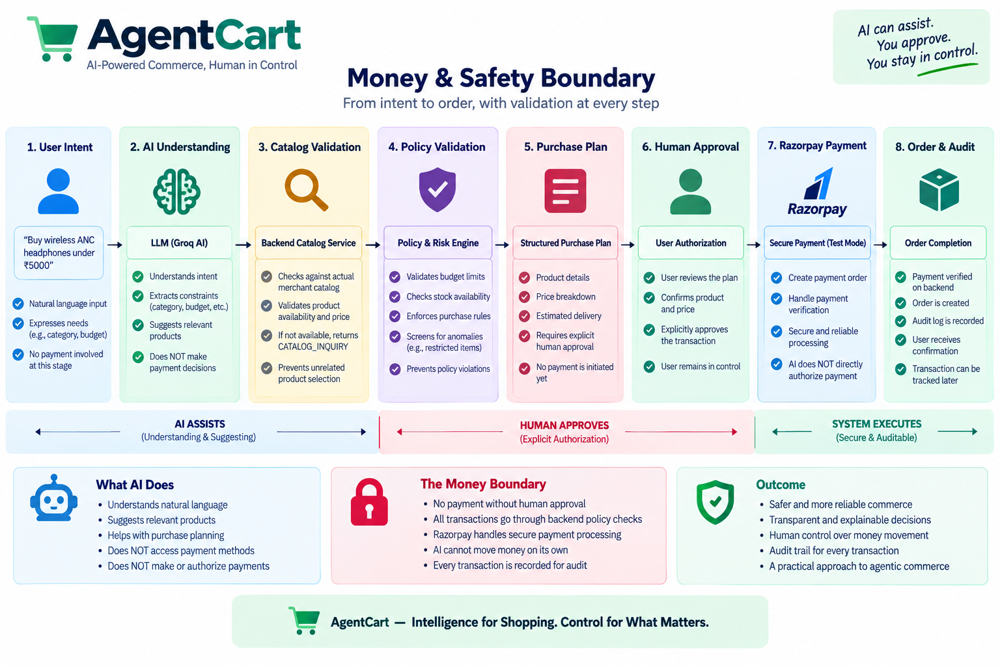

# AgentCart Architecture

## 1. Purpose

AgentCart converts a customer's natural-language shopping request into a
validated and explainable purchase plan while keeping financial
authorization outside the AI layer.

The architecture separates:

-   AI interpretation and recommendation
-   Deterministic catalog and policy validation
-   Human authorization
-   Payment processing
-   Payment verification
-   Order management
-   Fulfillment tracking
-   Notifications
-   Audit logging

### Central Control Boundary

``` text
AI Decision
     ↓
Catalog / Policy Validation
     ↓
Purchase Plan
     ↓
Human Approval
     ↓
Payment
     ↓
Payment Verification
     ↓
Order / Fulfillment
```

The AI is a decision-support component rather than an unrestricted
financial authority.

------------------------------------------------------------------------

## 2. System Architecture


At a high level:

``` text
                     CUSTOMER
                        │
                        ▼
               ┌─────────────────┐
               │ React Frontend  │
               │     + Vite      │
               └────────┬────────┘
                        │ HTTP
                        ▼
               ┌─────────────────┐
               │ FastAPI Backend │
               └────────┬────────┘
                        │
           ┌────────────┼────────────┐
           ▼            ▼            ▼
        SQLite         Groq       Razorpay
       Database         AI        Test Mode
```

------------------------------------------------------------------------

## 3. Deployment Architecture

The deployed application uses separate hosted frontend and backend
services.

``` text
Browser
   │
   ▼
Render Static Site
   │
   │ HTTPS API requests
   ▼
Render Web Service
   │
   ├── FastAPI
   ├── Groq integration
   ├── SQLite persistence
   └── Razorpay Test Mode
```

### Live Services

-   Frontend: https://agentcart-trpi.onrender.com/
-   Backend: https://agentcart-backend-amxc.onrender.com/

The local development architecture remains Docker-based.

------------------------------------------------------------------------

## 4. Frontend Architecture

The frontend is a React/Vite application.

``` text
frontend/src/
├── api/
│   └── client.js
├── components/
│   ├── AlternativeProducts.jsx
│   ├── ApprovalGate.jsx
│   ├── AuditTimeline.jsx
│   ├── DemoLogin.jsx
│   ├── NotificationCenter.jsx
│   ├── PaymentGate.jsx
│   ├── ProductDiscovery.jsx
│   └── PurchasePlan.jsx
├── pages/
│   ├── CommercePage.jsx
│   ├── OrdersPage.jsx
│   └── OrderDetailsPage.jsx
├── App.jsx
├── App.css
└── index.css
```

The main customer areas are:

``` text
Shop
 ↓
Orders
 ↓
Order Details
```

The commerce page contains the active agentic purchasing workflow.

------------------------------------------------------------------------

## 5. Backend Architecture

The backend uses FastAPI with separate API, schema, database,
integration, and service responsibilities.

``` text
backend/app/
├── api/
│   ├── agent.py
│   ├── audit.py
│   ├── catalog.py
│   ├── notifications.py
│   ├── orders.py
│   ├── payment.py
│   ├── purchase.py
│   └── tracking.py
├── db/
│   ├── database.py
│   ├── models.py
│   ├── seed.py
│   └── data/
│       ├── products.json
│       └── images/
├── schemas/
└── services/
    ├── agent_service.py
    ├── groq_adapter.py
    ├── notification_service.py
    ├── order_service.py
    └── tracking_service.py
```

Responsibilities:

-   **API layer:** HTTP boundaries
-   **Service layer:** business behavior
-   **Database layer:** persistence
-   **Schema layer:** request/response validation
-   **Groq adapter:** external AI integration boundary

------------------------------------------------------------------------

## 6. Natural-Language Agent Flow

For:

``` text
Buy wireless ANC headphones under ₹5000
```

the flow is:

``` text
Customer Request
      ↓
Agent API
      ↓
Groq Adapter
      ↓
Structured AI Intent
      ↓
Agent Service
      ↓
Catalog Validation
      ↓
Policy Validation
      ↓
Purchase Plan
```

The AI produces structured intent information.

The backend validates that information instead of blindly trusting it.

------------------------------------------------------------------------

## 7. Catalog Boundary

The controlled catalog is backed by:

``` text
backend/app/db/data/products.json
```

The catalog contains product information such as:

-   Product ID
-   Product name
-   Description
-   Price
-   Stock
-   Product attributes

Product images are stored under:

``` text
backend/app/db/data/images/
```

Catalog operations include:

``` text
Get products
Get product
Search products
```

The catalog is also the source used when looking for valid alternatives.

------------------------------------------------------------------------

## 8. Catalog Inquiry Boundary


AgentCart distinguishes a missing catalog category from a product that
exists but is unavailable.

For:

``` text
Is there any TV?
```

when TV is not represented in the catalog, the backend returns:

``` text
CATALOG_INQUIRY
```

with no purchase plan.

This prevents an unrelated product from being selected merely because
the AI is expected to return a product.

------------------------------------------------------------------------

## 9. Alternative Product Selection

When a genuine requested product exists but has zero stock:

``` text
Requested Product
      ↓
Stock Check
      ↓
Unavailable
      ↓
Find Available Catalog Products
      ↓
Rank Alternatives
      ↓
Customer Chooses
      ↓
Backend Revalidates
```

The customer explicitly selects the alternative.

The original budget remains part of the constraints.

------------------------------------------------------------------------

## 10. Purchase Plan

The purchase plan is the controlled intermediate state between
recommendation and payment.

A plan contains information such as:

-   Plan ID
-   Maximum budget
-   Currency
-   Status
-   Explanation
-   Product items
-   Quantity
-   Unit price

The plan allows the customer to inspect the proposed purchase before
authorization.

------------------------------------------------------------------------

## 11. Deterministic Policy Validation

The backend validates:

``` text
Product exists?
      ↓
Quantity valid?
      ↓
Stock sufficient?
      ↓
Within budget?
      ↓
Plan state valid?
      ↓
Continue
```

The purpose is to prevent model output from bypassing deterministic
commerce rules.

> **The AI may propose. The backend determines whether the proposal is
> valid.**

------------------------------------------------------------------------

## 12. Human Approval

Approval is an explicit state transition:

``` text
PLAN_CREATED
      ↓
POLICY_VALIDATED
      ↓
PLAN_APPROVED
```

Payment-order creation is gated behind approval.

``` text
AI Recommendation
        ≠
Customer Authorization
```

------------------------------------------------------------------------

## 13. Payment Architecture



AgentCart integrates Razorpay Test Mode.

``` text
Approved Plan
      ↓
Create Razorpay Order
      ↓
Razorpay Checkout
      ↓
Payment Response
      ↓
Backend Verification
      ↓
Payment Verified
      ↓
Purchase Completed
```

The frontend payment result is not treated as the authoritative
completion signal.

------------------------------------------------------------------------

## 14. Database Model

Major entities:

``` text
Product
PurchasePlan
PurchaseItem
PaymentOrder
AuditEvent
Fulfillment
Notification
```

Relationship concept:

``` text
Product
   │
   ▼
PurchaseItem
   │
   ▼
PurchasePlan
   │
   ├──────────────► AuditEvent
   │
   ▼
PaymentOrder
   │
   ▼
Fulfillment
   │
   └──────────────► Notification
```

Important transaction state is persisted in SQLite.

------------------------------------------------------------------------

## 15. Order Management

Order APIs:

``` text
GET /api/orders/
GET /api/orders/{order_id}
```

Persisted order information can include:

-   Order ID
-   Plan ID
-   Amount
-   Currency
-   Status
-   Razorpay order ID
-   Razorpay payment ID
-   Creation timestamp
-   Items
-   Plan explanation
-   Plan status

------------------------------------------------------------------------

## 16. Fulfillment Tracking

After successful payment verification, an order can enter the controlled
demonstration lifecycle:

``` text
PROCESSING
    ↓
SHIPPED
    ↓
OUT_FOR_DELIVERY
    ↓
DELIVERED
```

The tracking service:

1.  Validates order/payment eligibility
2.  Creates fulfillment state when appropriate
3.  Advances the fulfillment state
4.  Records an audit event
5.  Creates a notification

This is a controlled Buildathon demonstration, not a live courier
integration.

------------------------------------------------------------------------

## 17. Notification System

Notifications are persisted in the database.

Tracking transitions generate notifications:

``` text
PROCESSING
    ↓
Order is being prepared

SHIPPED
    ↓
Shipped

OUT_FOR_DELIVERY
    ↓
Out for delivery

DELIVERED
    ↓
Delivered
```

The frontend periodically retrieves the unread count and can open the
notification center.

------------------------------------------------------------------------

## 18. Audit System

Important transaction events are recorded chronologically.

Purchase lifecycle:

``` text
PLAN_CREATED
POLICY_VALIDATED
PLAN_APPROVED
PAYMENT_ORDER_CREATED
PAYMENT_VERIFIED
PURCHASE_COMPLETED
```

Fulfillment lifecycle:

``` text
FULFILLMENT_PROCESSING
FULFILLMENT_SHIPPED
FULFILLMENT_OUT_FOR_DELIVERY
FULFILLMENT_DELIVERED
```

The audit system provides an inspectable transaction history.

------------------------------------------------------------------------

## 19. API Boundaries

### Agent

``` text
POST /api/agent/purchase
POST /api/agent/select-product
```

### Catalog

``` text
GET /api/catalog/products
GET /api/catalog/products/{product_id}
GET /api/catalog/search
```

### Purchase

``` text
GET  /api/purchase/plans/{plan_id}
POST /api/purchase/plans/{plan_id}/approve
POST /api/purchase/plans/{plan_id}/reject
```

### Payment

``` text
POST /api/payment/plans/{plan_id}/orders
GET  /api/payment/orders/{payment_order_id}
POST /api/payment/orders/{payment_order_id}/verify
```

### Orders

``` text
GET /api/orders/
GET /api/orders/{order_id}
```

### Tracking

``` text
GET  /api/orders/{order_id}/tracking
POST /api/orders/{order_id}/tracking/advance
```

### Notifications

``` text
GET /api/notifications/
GET /api/notifications/unread-count
POST /api/notifications/{notification_id}/read
POST /api/notifications/read-all
```

### Audit

``` text
GET /api/audit/
GET /api/audit/plans/{plan_id}
```

------------------------------------------------------------------------

## 20. End-to-End Data Flow

``` text
Customer
   │
   │ Natural-language request
   ▼
Agent API
   │
   ▼
Groq Adapter
   │
   ▼
Structured Intent
   │
   ▼
Agent Service
   │
   ├──────────────► Catalog
   │
   └──────────────► Policy Validation
                         │
                         ▼
                   Purchase Plan
                         │
                         ▼
                   Human Approval
                         │
                         ▼
                     Payment API
                         │
                         ▼
                      Razorpay
                         │
                         ▼
                Backend Verification
                         │
                         ▼
                  Purchase Complete
                         │
                  ┌──────┴──────┐
                  ▼             ▼
                Orders        Audit
                  │
                  ▼
              Fulfillment
                  │
             ┌────┴────┐
             ▼         ▼
          Tracking  Notifications
```

------------------------------------------------------------------------

## 21. Docker Architecture

``` text
docker compose
      │
      ├── agentcart-frontend
      │       └── Nginx
      │           └── React production build
      │
      └── agentcart-backend
              └── FastAPI
                  └── Uvicorn
```

The frontend is built using Node/Vite and served by Nginx.

The backend runs independently as a Python service.

The SQLite database is persisted through the configured host mapping.

------------------------------------------------------------------------

## 22. Architectural Invariants

### Invariant 1

AI recommendation does not equal purchase authorization.

### Invariant 2

AI output does not replace deterministic backend validation.

### Invariant 3

A missing catalog category does not result in an unrelated product
selection.

### Invariant 4

Out-of-stock products are not silently substituted.

### Invariant 5

Customer budget is not silently increased.

### Invariant 6

Payment is gated behind human approval.

### Invariant 7

Payment must be verified before purchase completion.

### Invariant 8

Important lifecycle transitions are auditable.

### Invariant 9

Fulfillment notifications originate from backend state transitions.

------------------------------------------------------------------------

## 23. Design Philosophy

AgentCart is intentionally designed around **bounded agency**.

The goal is not:

``` text
Give AI complete control.
```

The goal is:

``` text
Give AI useful capabilities
while keeping high-impact actions
behind deterministic controls
and human authorization.
```

This allows AgentCart to demonstrate agentic commerce without treating
the AI model itself as a trusted financial authority.
