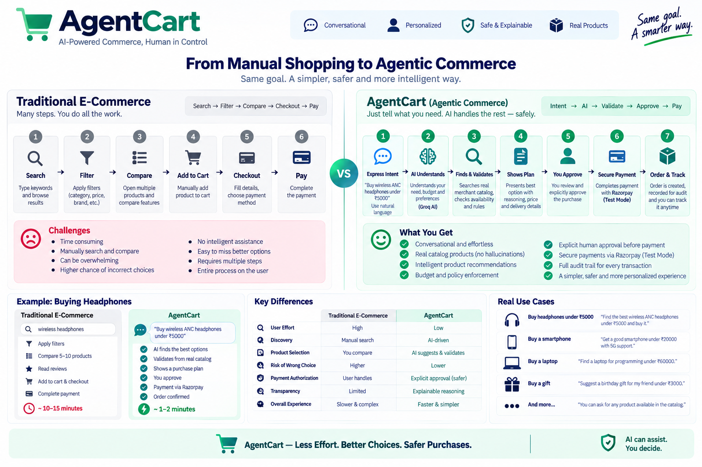

# AgentCart Demo Flow

## 1. Demo Objective

The five-minute Buildathon demonstration should communicate one central
idea:

> **An AI agent can make commerce easier without receiving unrestricted
> authority over the customer's money.**

The demo should show both:

1.  The intelligent path --- understanding intent and preparing a
    purchase
2.  The controlled path --- handling failure, requiring approval,
    verifying payment, and maintaining an audit trail

------------------------------------------------------------------------

## 2. Live Demo

**Frontend:** https://agentcart-trpi.onrender.com/

**Backend:** https://agentcart-backend-amxc.onrender.com/

Use the deployed application for the final presentation.

For local/Docker fallback:

``` text
Frontend: http://localhost
Backend:  http://localhost:8000
Swagger:  http://localhost:8000/docs
```

Payment mode:

``` text
Razorpay Test Mode
```

Never display API keys, `.env` files, or secret values.

------------------------------------------------------------------------

## 3. Demo Customer

The application uses a fictional demo identity for the Buildathon.

``` text
Name:        Arjun Mehta
Customer ID: AC-DEMO-001
Account:     Demo Customer
Payment:     Razorpay Test Mode
```

This is a frictionless demo identity, not production authentication.

------------------------------------------------------------------------

## 4. Primary Scenario

Use:

``` text
Buy wireless ANC headphones under ₹5000
```

This demonstrates:

-   Natural-language intent
-   AI recommendation
-   Catalog validation
-   Product information
-   Budget validation
-   Human approval
-   Razorpay Test Mode
-   Backend payment verification
-   Order creation
-   Audit trail

------------------------------------------------------------------------

## 5. Recommended 5-Minute Presentation

### 0:00--0:30 --- Problem

Say:

> "AI can understand what we want to buy, but giving an AI the ability
> to spend money creates a trust problem. AgentCart explores how AI can
> participate in commerce while keeping money movement explainable,
> bounded, and gated."

------------------------------------------------------------------------

### 0:30--1:00 --- Introduce AgentCart

Open the live application:

https://agentcart-trpi.onrender.com/

Say:

> "Instead of manually searching through an e-commerce site, the
> customer can describe what they want. AgentCart interprets the intent,
> validates it against the merchant's catalog and policies, and prepares
> a purchase for the customer to review."

------------------------------------------------------------------------

### 1:00--1:45 --- Natural-Language Request

Enter:

``` text
Buy wireless ANC headphones under ₹5000
```

Show the recommendation.

A representative catalog product is:

``` text
SoundMax Pro ANC
₹4,499
In stock
```

Point out the product image, details, price, availability, and purchase
plan.

------------------------------------------------------------------------

### 1:45--2:15 --- Explainability + Safety

Show:

``` text
Why this product?
```

Explain:

> "The recommendation is visible instead of being hidden inside the AI.
> The customer can understand why the product matches the request before
> approving anything."

Then show:

``` text
AI → Policy → Human Approval → Payment
```

------------------------------------------------------------------------

### 2:15--2:45 --- Human Approval + Razorpay

Review the purchase plan.

Show the explicit approval action.

Say:

> "The AI can recommend and prepare the purchase, but it cannot
> authorize the customer's payment."

Approve the plan and open Razorpay Test Mode.

Complete the test payment.

Explain:

> "The checkout response is not the final source of truth. AgentCart
> verifies the payment on the backend before completing the purchase."

------------------------------------------------------------------------

### 2:45--3:15 --- Order + Audit

Show the completed order and order details.

Point out:

-   Order ID
-   Plan ID
-   Amount
-   Payment status
-   Razorpay references

Then show the audit timeline:

``` text
PLAN_CREATED
POLICY_VALIDATED
PLAN_APPROVED
PAYMENT_ORDER_CREATED
PAYMENT_VERIFIED
PURCHASE_COMPLETED
```

Say:

> "The system does not only remember the final result. It records the
> important state transitions that led to it."

------------------------------------------------------------------------

### 3:15--3:45 --- Tracking + Notifications

Show the controlled fulfillment lifecycle:

``` text
Preparing
    ↓
Shipped
    ↓
Out for delivery
    ↓
Delivered
```

Advance the tracking state and show the corresponding notification.

Clarify:

> "This is a controlled Buildathon fulfillment demonstration, not a live
> logistics-provider integration."

------------------------------------------------------------------------

### 3:45--4:30 --- Failure Handling

Enter:

``` text
Is there any TV?
```

Expected:

``` text
CATALOG_INQUIRY
```

Show that no purchase plan or approval gate is created.

Say:

> "TV is not in the merchant's catalog, so AgentCart does not invent a
> product or silently substitute a headphone. It tells the customer the
> category is unavailable and keeps them in the actual catalog."

This is a key Buildathon demonstration because it shows graceful
failure.

------------------------------------------------------------------------

### 4:30--4:50 --- Out-of-Stock Recovery

Demonstrate the out-of-stock product flow:

``` text
Requested Product
      ↓
Stock = 0
      ↓
Alternatives
      ↓
Customer Chooses
      ↓
Backend Revalidation
```

Say:

> "An agent should not silently substitute something the customer never
> selected."

------------------------------------------------------------------------

### 4:50--5:00 --- Closing

Say:

> "AgentCart makes AI commerce actionable without making it
> uncontrolled. The agent understands intent, recommends and prepares
> the purchase, the backend enforces policies, the customer approves the
> financial action, payment is verified, and the transaction remains
> auditable."

------------------------------------------------------------------------

## 6. Important Demo Scenario: Unavailable Category

Use:

``` text
Is there any TV?
```

Expected flow:

``` text
Requested Category
       ↓
Not represented in catalog
       ↓
CATALOG_INQUIRY
       ↓
Explain unavailability
       ↓
Show actual catalog
       ↓
Customer chooses if desired
```

The system must not:

-   Invent a TV
-   Select an unrelated product
-   Create a purchase plan
-   Show an approval gate
-   Start payment

This is the strongest failure-handling example for the Buildathon.

------------------------------------------------------------------------

## 7. Out-of-Stock Scenario

Use the intentionally unavailable catalog product.

Expected:

``` text
Requested Product
      ↓
Stock = 0
      ↓
Alternatives
      ↓
Customer Chooses
      ↓
Backend Revalidation
      ↓
Purchase Plan
```

The customer explicitly controls substitution.

------------------------------------------------------------------------

## 8. Budget Preservation

Example:

``` text
Original budget: ₹5000
Alternative:     ₹5799
```

Say:

> "AgentCart does not silently raise the customer's budget because the
> original product became unavailable."

The original budget remains authoritative.

------------------------------------------------------------------------

## 9. Rejection Scenario

Create a purchase plan and reject it.

``` text
Purchase Plan
      ↓
Customer Rejects
      ↓
Purchase Stops
```

Say:

> "The customer's rejection is authoritative. The AI recommendation
> cannot override it."

------------------------------------------------------------------------

## 10. Judge-Facing Architecture Visual



Use the visual to explain the difference between manual shopping and the
AgentCart agentic flow.

------------------------------------------------------------------------

## 11. Demo Hygiene

Before recording:

-   Use the deployed application
-   Confirm Test Mode
-   Do not show secrets
-   Do not show `.env`
-   Avoid claiming real money was transferred
-   Describe fulfillment as controlled/demo
-   Keep the demonstration focused on the Buildathon track

------------------------------------------------------------------------

## 12. Demo Checklist

### Application

-   [ ] Frontend loads
-   [ ] Backend is healthy
-   [ ] Login works
-   [ ] Catalog loads

### AI

-   [ ] Natural-language request works
-   [ ] Recommendation appears
-   [ ] Explanation appears
-   [ ] Missing catalog category returns `CATALOG_INQUIRY`

### Policy

-   [ ] Budget validation works
-   [ ] Stock validation works
-   [ ] Quantity validation works
-   [ ] Approval gate works
-   [ ] Rejection stops progression

### Payment

-   [ ] Razorpay Test Mode works
-   [ ] Payment verification works
-   [ ] Purchase completion works

### Post-Purchase

-   [ ] Order history works
-   [ ] Order details work
-   [ ] Audit timeline works
-   [ ] Tracking works
-   [ ] Notifications work

### Failure Handling

-   [ ] Missing catalog request works
-   [ ] Out-of-stock recovery works
-   [ ] Alternative selection works
-   [ ] Original budget remains enforced
-   [ ] Rejection works

### Demo Hygiene

-   [ ] No API secrets visible
-   [ ] No `.env` displayed
-   [ ] Test Mode clearly identified
-   [ ] Tracking described as controlled/demo
